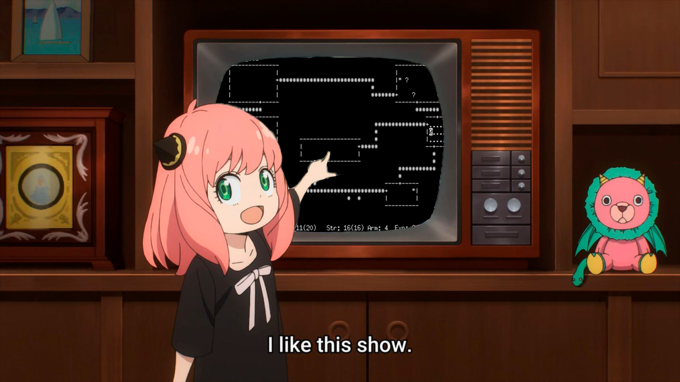

# Chizuru
Chizuru is an AI that plays the 1980 computer game Rogue.
While this repository contains the code for the AI, it also contains the dissertation released alongside this code in `writeup/`.

You can learn more about Rogue, its history and the way it plays on [this webpage](https://nethackwiki.com/wiki/Rogue_(game)).

## Setup
This thing is designed to run in a Docker container. To do that, run these:
```shell
docker build -t chizuru .
docker run
```
After that, it should be smooth sailing.

If you want to run this locally, you need to use Python 3.7. Rogue-gym does not install in higher Python versions, I think. It didn't work when I tried to install on Python 3.11.

## Files
The model is located in `chizuru.py`. The training file and logic is written in `train.py`, and the code for previewing how the AI plays is located in `preview.py`. Seeing is believing, after all.

Chizuru saves its training checkpoints every few episodes to `training/czr-xxxx.ckpt` where `xxxx` is the interval number. It saves a new checkpoint every 500 episodes.

## Bugs
Probably infinite (although countably infinite). However, the distant screams of your PC and/or GPU cloud running this model is *not* a bug. It's a feature.

## Licence
This program is released under the GNU General Public Licence v3.0, except for the writeup, which is copyrighted.

You should have received a copy of the GNU General Public Licence
along with this program. If not, see <https://www.gnu.org/licenses/>.
